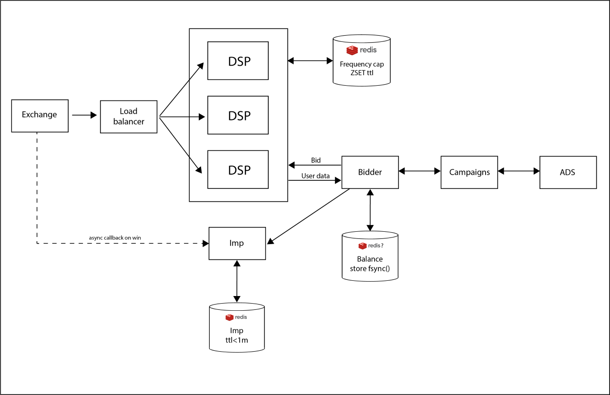

 Wip: DSP Challenge
======
### Challenge: Implement a simplified Demand Side Platform

#### Intro

I'm doing this to challenge to both learn about how to better architecture microservices based systems and to get more Go experience.

Secondarily to learn about DSPS as they are some incredible pieces of software engineering. Very large volume while keeping full roundtrip to >100ms

Current status is just a basic api with some frequency capping and a memory store. I'm trying to keep Go libs dependencies at a minimum to better understand which challenges they solve, why and how.

Be mindful that this project was born in a weekend and out of my zone of comfort which are strongly typed languages so this repo isn't exactly representative of how I code on a daily basis. 

In general I aim to have code that is both well tested and readable.

## Contributing

I welcome any and all constructive criticism.

I'm really thankful for any comment (or even better a PR!) sent my way. As neither system nor codebase architecture could be ideal.

####Requirements

 * Implement /bid route that recieves bid information
 * Implement bidding
 * Delegate to bidder implementation
 * Set up redis
 * Properly handle currency through fixed point math/big decimals
 * Implement impressions callback count route / count (impid=102)
 * Ideally load balancers should assign requests to nodes by round-robin or hash sharded userId
 * Ideally avoid locking on global balance by partitioning balance by nodes? Unsure about this. Maybe a standard locking RDBMS would still do a good job but I'm worried on locking contention.
 * At most 5 impressions per minute, per user basis
 * At most 10 impressions every 3 minutes, per user basis
 * A maximum of 10 USD to spend per day, system wide

### Ideal architecture diagram

### Current architecture

## Caveats (also a Todo list)
(**NOT PRODUCTION READY**)
* Absolutely not ready for production usage. Nor anything!
* It never checks the Accept header of the request, the errors responses are lacking additional details and proper envelopes. 
* HTTP server also never validates the data the client sends
* Should eventually switch to an already made HttpRestApi server such as Gin, Mux or Chi
* Should dockerize
* Also has unbounded memory caches which should eventually be swapped for Redis
* Should use probably implement a sliding window sorted set for Balance/Ratelimits like Redis ZSet with a TTL
* Bidding is completely random, bidding service should be split and should include a learning phase from historical data
* Learning phase could use Bayesian statistics, neural networks, association rule learning,
  clustering, or other techniques to calculate the bonuses from historical data. These other methods
  may offer more mathematically rigorous results, which may result in better
  CTRs, and ultimately more money earned. See `/rtb-opt.pdf`
* Random uses Math.Rand for bid generation which could lead to bid prediction by an adversary.
* I will eventually move the balance to its own Redis server. I'm worried on lock contention
* Redis IS NOT not configured for durability guarantees. No SLA guarantee for money handling system. Discrepancies in balance are expected.
* This could be remediated by `set appendfsync` at a performance tradeoff.
* TEST TEST TEST!
* Implement a super dumb exchange node to test against.

## References
* [OpenRTB Specification](https://www.iab.com/wp-content/uploads/2016/03/OpenRTB-API-Specification-Version-2-5-FINAL.pdf)

* [Pitaya, very cool, very good reference](https://github.com/topfreegames/pitaya)

* [cpp DSP implementation and framework alleged 100k rps per node](https://github.com/venediktov/vanilla-rtb/blob/master/examples/bidder/multi_bidder.cpp)
